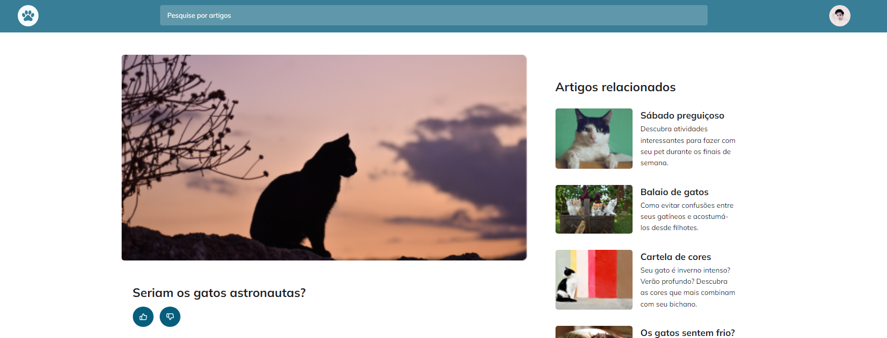

<h1 align="center"> Desafio 04 </h1>

Projeto realizado no curso Explorer da [Rocketseat](https://www.rocketseat.com.br) com o objetivo de estudar manipulação de textos e alinhamento de elementos com HTML e CSS.

  

## 🚀 Tecnologias

Esse projeto foi desenvolvido com as seguintes tecnologias:

- HTML e CSS
- Git e Github
- Figma

## 🔖 Layout

Você pode visualizar o layout do projeto através [DESSE LINK](<https://www.figma.com/file/BYKWVsiQAZMtrwHYPkG5nE/Blog-de-Gatos-%E2%80%A2-Desafio-Explorer-(Community)?type=design&node-id=2-197&mode=design&t=i2q9aY035y6aGLbV-0>). É necessário ter conta no [Figma](https://figma.com) para acessá-lo.
